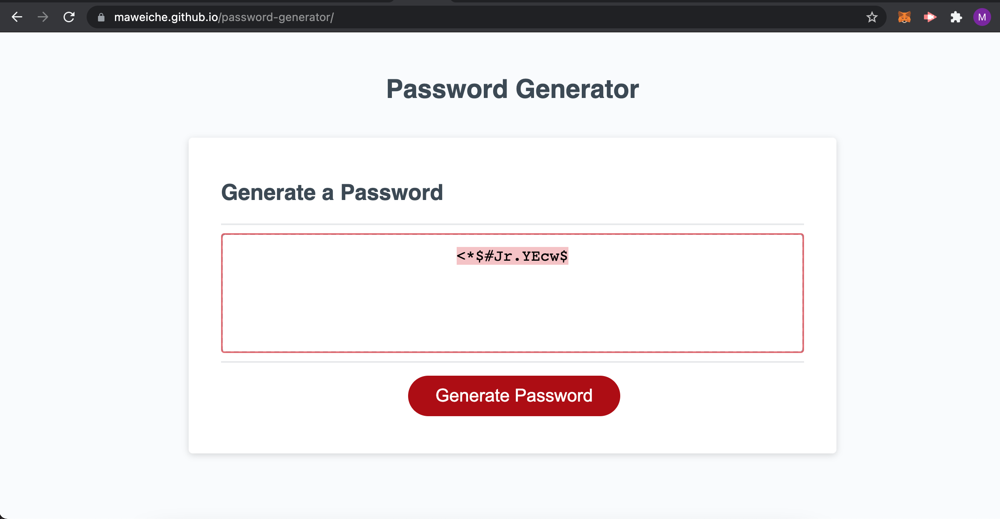

# Random Password Generator

The goal of this project was to work off of pre-existing code to complete the build of a Random Password Generator.  When the URL is loaded, the user is presented with a button tied to a click event for generating a password.  Once the button is clicked the user is presented with a prompt and several confirms to determine the length of the password and what type of characters to use.  After the user inputs their answers a random password is presented to them on screen with the parameters they provided.

## Built With

* [HTML](https://developer.mozilla.org/en-US/docs/Web/HTML)
* [CSS](https://developer.mozilla.org/en-US/docs/Web/CSS)
* [Javascript](https://developer.mozilla.org/en-US/docs/Web/JavaScript)

## Deployed Link

* [See Live Site](Assets/passwordstillshot.png)

## Screenshot

## Authors

* **Matt Weichel** 

- [Link to Portfolio Site](https://maweiche.github.io/myportfolio/)
- [Link to Github](https://github.com/maweiche)

## License

This project is licensed under the MIT License 

## Acknowledgments

* Hat tip to anyone whose code, libraries, packages, or UI was used  / inspired from

